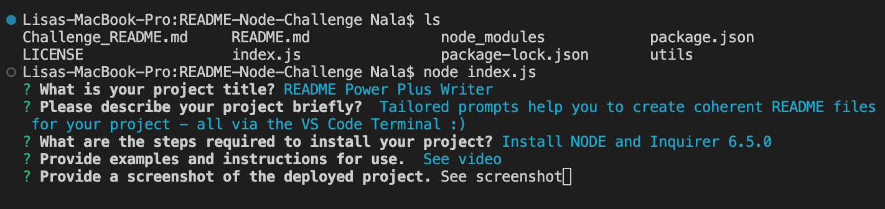

# README Node Challenge
Tailored prompts help you to create coherent README files for your project - all via the VS Code Terminal!

# Summary Description
This program will help you to write README files. The prompts it generates in the VS Code terminal make sure that you don't forget about essential information and streamline the content of all your projects. I hope you find it useful!

## User Story

### As an developer:

- I want to use a template via the VS Code Terminal for creating README files
- So that I can save time,
- Be consistent in my output,
- And create sound documentation for others to refer to.

## App description

- Can be used via VS Code Terminal
- Creates a README file
- Uses prompts

## Who is the target audience?
- Anyone who wants to streamline their README files.
- New developers who need guidance in what's important to include.

## What is the problem that it addresses?
- Creating consistent README files is hard
- Remembering all essentials can be time consuming
- README file writing can feel like a chore

## How does the product solve that problem?
- prompts
- links to license badges
- most popular licenses included in list to select from

## CSS
N/A: Runs in VS Code

## HTML
N/A: Runs in VS Code

## JavaScript
Using function with switch statement to create license badges and link to their license files, jQuery to grab information from user input in terminal (prompts).

## Installation
Node and Inquirer 6.5.0

## Usage

GitHub Repo: https://github.com/LisaMLorenz/README-Node-Challenge
Demo Video: https://youtu.be/Cm_pAYxG5wk

### Task: Technical Requirements

* Create a command-line application that accepts user input.
* When a user is prompted for information, a high-quality README.md is created with:
* Project Title, Description, Table of Contents, Installation, Usage, License, Contributing, Tests, Questions
* When a user enters the project title, it's displayed as the title of the README..
* When a user enters a description, installation instructions, usage information, contribution guidelines, and test instructions, this information is added to the sections of the README entitled Description, Installation, Usage, Contributing, and Tests.
* When a user chooses a license for their application from a list of options, a badge for that license is added near the top of the README and a notice is added to the section of the README entitled License that explains which license the application is covered under.
* When a user enters their GitHub username, it's added to the section of the README entitled Questions, with a link to their GitHub profile.
* When a user enters their email address, it's added to the section of the README entitled Questions, with instructions on how to reach them with additional questions.
* When a user clicks on the links in the Table of Contents, they are taken to the corresponding section of the README.

## License

This project is licensed under the MIT license.

## Collaborators

Lisa Lorenz

## Tests

Tested in VS Code Terminal

## Questions

Please get in touch via [GitHub](https://github.com/LisaMLorenz) or contact directly via hej@frau-lorenz.de.